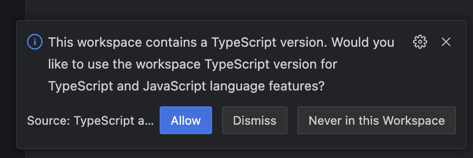

Playground for TypeScript Language Service Plugin powered by Volar.js.

## How to run

1. Open [https://stackblitz.com/~/github.com/mizdra/playground-volar-typescript-service-plugin?file=example/index.ts](https://stackblitz.com/~/github.com/mizdra/playground-volar-typescript-service-plugin?file=example/index.ts)
1. When the following prompt appears, select "Allow".
    - 
1. Check that `I_PNG` in `example/index.ts` is typed as `{ src: string; width: number; height: number; }`.
